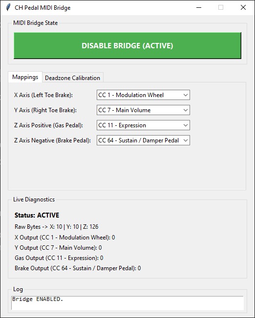

# Pedal to MIDI Bridge (`pedal_to_midi.py`)



A lightweight utility that turns gaming pedals into a versatile MIDI expression setup. Unlike a traditional expression pedal locked to a single control channel, this utility lets you route up to four independent MIDI CC parameters simultaneously across all three pedal axes. You can map parameters like Expression, Volume, or Sustain directly at the hardware bridge level without having to reconfigure your DAW setup every time.

It works by converting raw HID input from the pedals into MIDI Control Change (CC) messages for the DAW via a virtual MIDI port. 

Tested on **Windows 10** with **Waveform** and **CH Products Pro Pedals USB**. It should hopefully work for your rig as well.

## Prerequisites (Virtual MIDI Port)

Before launching the app, you need a virtual MIDI loopback driver so your DAW can listen to messages generated by the script:

1. Download and install **[loopMIDI](https://www.tobias-erichsen.de/software/loopmidi.html)** (free).
2. Open loopMIDI and add a new port named **`PedalMIDI`**..
3. Leave loopMIDI running in the background.

## Installation & Running

Choose one of the two ways to run the application below.

### Option A: Executable Release (No Python Required)

1. Go to the **Releases** section of this repository and download `pedal_to_midi.zip`.
2. Extract the contents of `pedal_to_midi.zip` to a folder on your PC.
3. Launch `pedal_to_midi.exe`. Ignore the scary blue warning.

### Option B: From Source (`pedal_to_midi.py`)

> ⚠️ **Python Version Constraint:**  
> Requires **Python 3.12**. It currently **will not work on Python 3.13+** due to missing upstream compatibility in `python-rtmidi`.

#### 1. Running with `uv` (Recommended)
If you have [`uv`](https://docs.astral.sh/uv/) installed, inline script metadata will automatically install dependencies into an isolated environment on launch:

```bash
uv run pedal_to_midi.py

## 2. Running with Standard pip

If using standard Python 3.12, manually install the dependencies first:

```bash
pip install hidapi mido python-rtmidi
python pedal_to_midi.py
```

## Usage Guide

1. Ensure your virtual MIDI port (**PedalMIDI**) is running.

2. Launch `pedal_to_midi.exe` or execute:

   ```bash
   python pedal_to_midi.py
   ```

3. In the **Mappings** tab, select which MIDI CC values each pedal action should send:
   - Left Toe Brake
   - Right Toe Brake
   - Gas Pedal
   - Brake Pedal

4. *(Optional)* Switch to the **Deadzone Calibration** tab to adjust thresholds if your physical pedals suffer from resting hardware drift.

5. **Enable the Bridge:** Click the large toggle button at the top of the application window. When active, the button turns **green** and live MIDI output begins routing.

6. Open your DAW (e.g., **Waveform**) and enable **PedalMIDI** as an active MIDI input device in your audio/MIDI settings.

> 💡 **Tip:** Use the large top button as an immediate **ON/OFF** toggle whenever you want to temporarily bypass sending pedal messages to your DAW.
